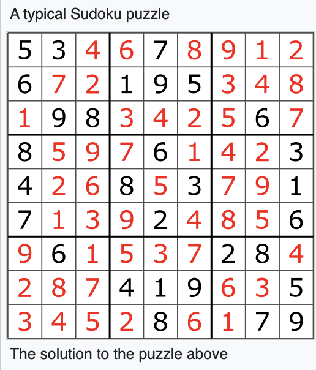

# Cash Interview Code Example

## TL;DR
Original code for the Cash Interview.  Efficient implementation of Sudoku backtracking.  Total time 3hrs including writeup.

## Background
I spent the weekend doing leetcode in preparation and came across a Sudoku backtracking question.  
The [solutions](https://www.baeldung.com/java-sudoku) seemed lacking in a number of ways:

- recursion which was unnecessary, see the section below
- int (4 bytes) when only 4bits were only really necessary
- bad boundary and error checking
- using a 2D array when a 1D was adequate

## Problem
[Sudoku](https://en.wikipedia.org/wiki/Sudoku) is a well known game.  It involves filling in the blanks with no duplication for
rows/columns/squares.

### Memory Allocation
I've spent the last couple of years on an Infinite Reactive Streams project, and I know the benefits of Pure coding,
however, in this sort of problem it can be worth optimizing for memory.  This solution uses two byte[81].  I've 
worked on a number of GC free systems.  Part of this stems from coming from a Physics (Electronics) background.

Of course, it would be possible to further optimize with some sort of bit array, but that is probably a step too far :)

### Performance
The best performance from this solution is a simple linear scan, therefore o(n).  The worst case involves a lot of 
backtracking, but since the 'hardest' problem was solved in 15ms we are working within bounds.

### Recursion
Recursion is taught heavily in computer science and is a good way to break apart a problem, it can also be used to 
parallelize a job.  It is [provable](https://en.wikipedia.org/wiki/Church%E2%80%93Turing_thesis) that any
recursive problem can be rewritten in an iterative manner.  Tail-recursion is interesting, but so far I've found little
benefit in production code.  Instead, I've seen issues with StackOverflow especially as we've been dealing with large
graphs.  I encourage my team to refactor recursive code into iterative code.  Obviously this can be done using a 
[Stack](https://docs.oracle.com/en/java/javase/11/docs/api/java.base/java/util/ArrayDeque.html).  
However, in the case of the Sudoku problem there is no need for a recursive solution when a simple loop will do.

### Thread safety
We always try to understand thread-safety when building APIs.  In this case the single method makes that easier, but 
further documentation could be useful.  Obviously there are dangers with mutating the grid directly.

### Bounds checking
Bounds checking is really critical, I tried to make the Sudoku solution as simple an api as possible:

`Sudoku.solve(final byte[] grid) throws GridException`

The tests handle the following bounds cases:

- Null grid
- Incorrect size of grid
- Out of bounds values ( <0 or >9)
- An invalid Sudoku grid

For a real-world APIs we've had success with (however it is possible for users to circumvent these): 

- [Checkstyles](https://checkstyle.sourceforge.io/)
- [Checker Framework](https://checkerframework.org/)
- [Lombok](https://projectlombok.org/features/NonNull)

### Error handling
The current system I am working on uses back-pressure, hospital queues, error codes etc. to handle error cases.
In this case I just used a simple Exception with a message to handle error cases.  This part of the code could be 
significantly improved.

### Better solutions
There are a number of better solutions to Sudoku, I guess I'll get to them in time:

- Dancing Links
- Algorithm X
- Reduction to exact cover

I found this afterwards when I was doing this writeup : [solutions](https://medium.com/optima-blog/solving-sudoku-fast-702912c13307)

### Further work
Lately I've been doing a bunch of React work, so it would be easy to convert this into a rich-web solution.
Envisioning the following features:

- The ability to visualize the solving of the problem
- Much Larger grids (eg. 16 x 16)
- There can be multiple solutions to Sudoku problems (consider a blank grid for example), this could be added, though the number of solutions could be very high
- I did consider rewriting this is Kotlin, but as we've been doing a lot of Java17 recently ([Valhalla value objects](https://openjdk.java.net/jeps/8277163)) this felt more comfortable
- I could have made more use of Streams in my solution, but I explicitly wanted to try a low level array solution
- I would have liked to do some profiling of this solution if I'd had more time, which could have produced further optimizations

### Conclusion
Enjoyed writing some low level performant code.  Hope it helps!

